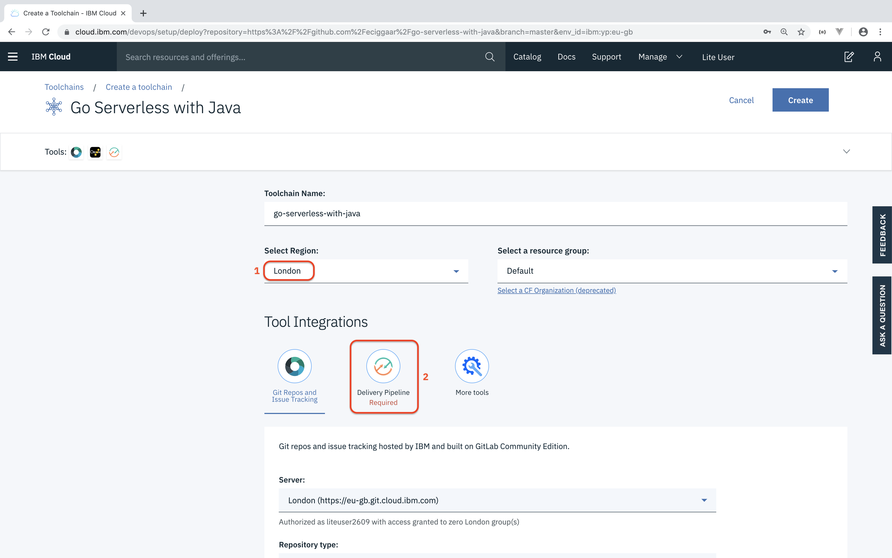
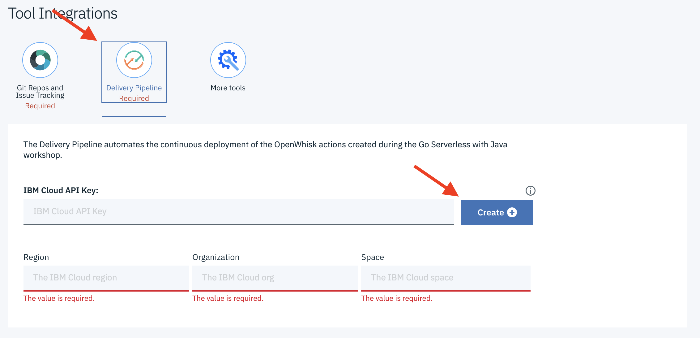

# Steps for Deploying an Application

1. Right click on the below button to open in the window in a new tab (the below button is demonstration only)

	
2. Make sure the region (1) is set to Dallas (us-south). Next, click (2) to configure the Delivery Pipeline.

	

3. Next create an API Key for this repo by clicking **Delivery Pipeline** and then the **Create** button. The default values that are generated should be fine.

	

4. Cick the **Create** button in the top right corner of the page.

## 